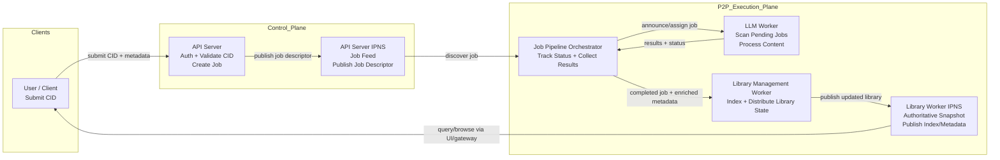

# Cloud-Based Intelligent Autonomous Knowledge Management Framework over IPFS/IPNS

## Introduction

Modern knowledge management systems are typically centralized, creating challenges related to scalability, resilience, data ownership, and collaborative intelligence. At the same time, fully decentralized systems often lack coordinated workflow control and intelligent automation.

This project proposes a cloud-based Intelligent Autonomous Network (IAN) knowledge management framework that operates over a decentralized P2P infrastructure using IPFS/IPNS. The framework adopts a hybrid architecture consisting of a cloud-managed control plane and a decentralized execution/data plane. The control plane coordinates authentication, job scheduling, and policy enforcement, while distributed worker nodes collaboratively provide storage, indexing, and AI-powered knowledge processing services.

The proposed system demonstrates how cloud-centric orchestration can coexist with decentralized infrastructure to support scalable, resilient, and intelligent knowledge workflows.

## High-Level System Overview

The proposed framework enables users to submit knowledge artifacts (documents, notes, datasets, etc.) as IPFS content identifiers (CIDs). These artifacts are processed by distributed workers for indexing, summarization, and enrichment before becoming part of a decentralized knowledge library.

The system consists of four main logical components:

### Control Plane (authoritative)

#### API Server

The API server acts as the entry gateway into the system and provides:

- user authentication and access control
- CID submission validation
- job creation and coordination
- system policy enforcement

Once a submission is accepted, a job descriptor is generated and published via IPNS for discovery by distributed workers. The control plane is logically centralized but can be replicated for availability and scalability.

### Decentralized Execution Plane

All distributed nodes communicate using IPFS and IPNS, forming the decentralized service backbone.

#### Library Management Worker

Responsibilities:

- maintains indexed knowledge metadata
- distributes authoritative knowledge library snapshots via IPNS
- ensures replication and consistency across nodes

These workers form the backbone of the decentralized knowledge repository.

#### Job Pipeline Orchestrator

Responsibilities:

- monitors job descriptors
- tracks lifecycle states (pending, running, completed, failed)
- aggregates results from distributed workers

This component enables autonomous workflow coordination across the network.

#### LLM Worker

Responsibilities:

- detects pending AI-processing jobs
- performs automated knowledge analysis (summarization, tagging, structuring)
- generates embeddings and metadata enrichment

LLM workers operate autonomously and scale horizontally across nodes.

### System Interaction Flow

